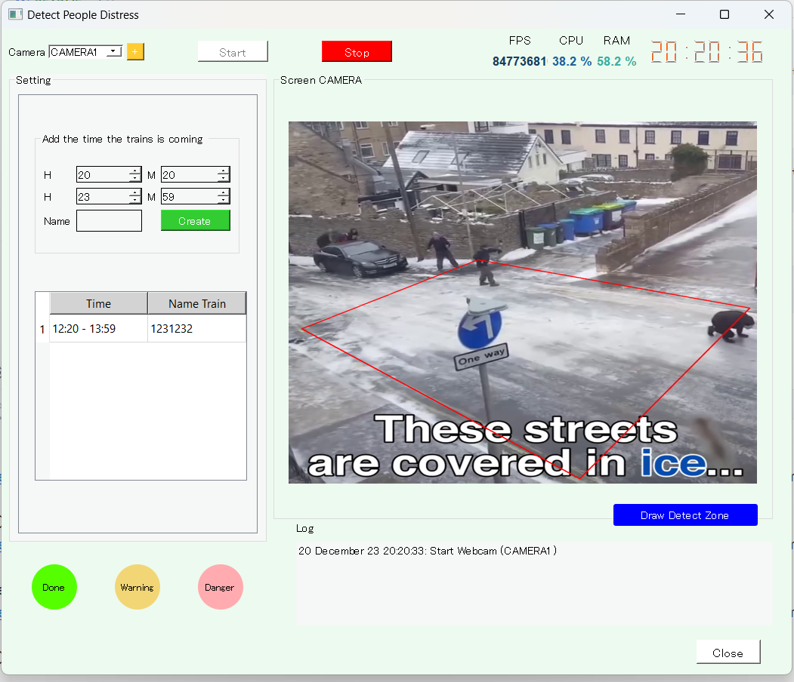

# Detect People Distress
This project helps the railway management to detect a fall in camera area.

1. [Setting](#setting)
2. [Image](#image)
3. [Facebook](#facebook)


## Setting 
Clone project
````bash   
git clone https://github.com/lvnh2003/Detect-People-Distress.git
# Additional environment setup
````
Move to project 
````bash   
cd Detect-People-Distress
````
Install packages requirements
````bash   
pip install -r requirement.txt
# Requirements installation may be needed.
````
Run project 
````bash   
python main.py
````

## Image



## Facebook
Connect with me on Facebook: [Nguyễn Ngọc Lanh](https://www.facebook.com/lanh.justlanh/) 
